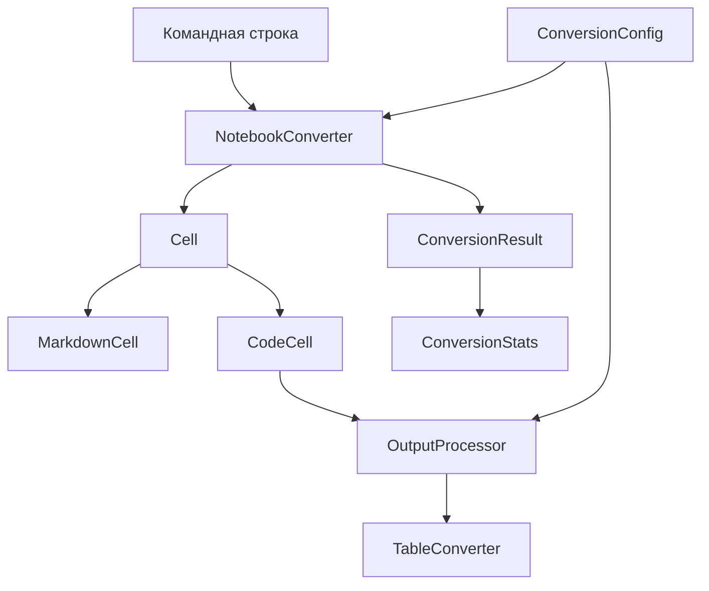

# Jupyter Cleaner

Jupyter Cleaner — программа для командной строки, которая превращает блокноты Jupyter (`.ipynb`) в аккуратные файлы Markdown (`.md`).

Она сохраняет текст и код, убирает ненужные результаты выполнения и не переносит в итоговый файл громоздкую разметку HTML.

## Зачем это нужно

Мне часто приходится переносить материалы из Jupyter в Markdown: для заметок, документации, GitHub или дальнейшей работы с ChatGPT.

Проблема в том, что файл `.ipynb` хранит намного больше, чем просто текст и код. В нём также находятся результаты выполнения ячеек, таблицы, разметка HTML и другие служебные данные.

Из-за этого при обычном переносе можно получить огромный файл, в котором полезный материал теряется среди технического содержимого.

Особенно это заметно на таблицах: вместо небольшой таблицы в Markdown в файл может попасть большой фрагмент HTML с множеством тегов `<div>`, `<table>`, `<tr>`, `<td>` и других элементов.

Jupyter Cleaner решает эту задачу автоматически.

```text
блокнот Jupyter
        ↓
чтение структуры .ipynb
        ↓
выбор полезного содержимого
        ↓
чистый Markdown
```

Программа сохраняет текстовые ячейки, оформляет код в отдельные блоки, а результаты выполнения либо полностью удаляет, либо сохраняет только в поддерживаемом виде.

## Пример

В репозитории есть настоящий пример преобразования:

[Исходный блокнот Jupyter](https://chatgpt.com/g/g-p-6a8ff4773df481918627e21ad431f52c/c/examples/example.ipynb) → [готовый Markdown](https://chatgpt.com/g/g-p-6a8ff4773df481918627e21ad431f52c/c/examples/example.md)

Для этого примера получились следующие результаты:

|Показатель|Результат|
|---|--:|
|Размер исходного файла|358,47 КиБ|
|Размер Markdown|38,19 КиБ|
|Уменьшение размера|89,3 %|
|Удалено представлений HTML|16|
|Преобразовано таблиц|3|

Точные значения в байтах и способ измерения находятся в [описании примера](https://chatgpt.com/g/g-p-6a8ff4773df481918627e21ad431f52c/c/docs/example_metrics.md).

## Установка

Проект пока не опубликован в общем хранилище пакетов Python, поэтому его нужно установить из исходного кода.

Для управления окружением и зависимостями используется `uv`.

```bash
git clone https://github.com/daniellenova/jupyter-cleaner
cd jupyter-cleaner
uv sync --locked
```

Команда `uv sync --locked` создаст окружение и установит именно те версии зависимостей, которые зафиксированы в `uv.lock`.

## Как пользоваться

Самый простой вариант:

```bash
uv run jupyter-cleaner convert examples/basic.ipynb
```

Рядом с исходным файлом появится:

```text
examples/basic.md
```

По умолчанию все результаты выполнения ячеек удаляются.

### Сохранить полезные результаты выполнения

Если нужно оставить обычный текстовый вывод и поддерживаемые таблицы:

```bash
uv run jupyter-cleaner convert examples/table.ipynb --keep-outputs
```

Например, результат:

```python
print("Привет!")
```

может быть сохранён вместе с выводом:

```text
Привет!
```

При этом громоздкая разметка HTML в итоговый Markdown не переносится.

### Не преобразовывать таблицы

Если результаты нужно сохранить, но таблицы не нужно превращать в Markdown:

```bash
uv run jupyter-cleaner convert examples/table.ipynb \
    --keep-outputs \
    --no-tables
```

В таком случае программа использует обычное текстовое представление таблицы, если оно есть.

### Указать имя итогового файла

```bash
uv run jupyter-cleaner convert examples/basic.ipynb \
    --output notes.md
```

Короткая запись:

```bash
uv run jupyter-cleaner convert examples/basic.ipynb -o notes.md
```

### Обработать целый каталог

Можно передать не отдельный файл, а каталог:

```bash
uv run jupyter-cleaner convert examples/
```

Программа найдёт все файлы `.ipynb` непосредственно в этом каталоге и обработает их по очереди.

Во вложенные каталоги она не заходит.

Готовые `.md` будут сохранены рядом с исходными файлами.

Если один из блокнотов окажется повреждён, остальные всё равно будут обработаны, а в конце программа покажет итог.

### Посмотреть справку

```bash
uv run jupyter-cleaner --help
```

Справка по команде преобразования:

```bash
uv run jupyter-cleaner convert --help
```

## Что умеет программа

Jupyter Cleaner умеет:

- превращать один файл `.ipynb` в `.md`;
    
- обрабатывать сразу несколько блокнотов в одном каталоге;
    
- сохранять обычные текстовые ячейки;
    
- оформлять ячейки с кодом как блоки Python;
    
- пропускать пустые ячейки;
    
- полностью удалять результаты выполнения;
    
- по желанию сохранять поддерживаемые текстовые результаты;
    
- сохранять обычный вывод программы;
    
- работать с `text/plain`;
    
- не переносить исходную разметку HTML;
    
- превращать поддерживаемые таблицы Pandas в таблицы Markdown;
    
- показывать статистику преобразования;
    
- показывать размер файла до и после обработки;
    
- сохранять результат под указанным пользователем именем.
    

## Что пока не поддерживается

> **Jupyter Cleaner не запускает код из блокнота.** Он работает только с тем содержимым, которое уже сохранено внутри `.ipynb`.

У программы есть несколько сознательных ограничений:

- изображения из результатов выполнения не сохраняются;
    
- произвольная разметка HTML не преобразуется;
    
- поддерживаются только простые таблицы Pandas определённой структуры;
    
- сложные таблицы с объединёнными ячейками не поддерживаются;
    
- интерактивные элементы Jupyter не поддерживаются;
    
- неизвестные представления результатов могут быть пропущены;
    
- результаты выполнения с ошибками сейчас не переносятся в Markdown;
    
- вложенные каталоги при обработке папки не просматриваются;
    
- если итоговый файл уже существует, он будет перезаписан.
    

Проект специально не пытается поддерживать все возможные особенности Jupyter. Его задача намного уже: получить из обычного исследовательского блокнота удобный и компактный Markdown.

## Как устроен проект

Пользователь работает только с командной строкой.

Внутри обработка разделена на несколько частей:



Основные файлы проекта:

- `cli.py` — принимает команды пользователя, сохраняет результат и выводит статистику;
    
- `converter.py` — управляет всем процессом преобразования;
    
- `cells.py` — отвечает за текстовые ячейки и ячейки с кодом;
    
- `outputs.py` — обрабатывает результаты выполнения;
    
- `tables.py` — распознаёт и преобразует поддерживаемые таблицы;
    
- `models.py` — хранит результат преобразования и статистику;
    
- `config.py` — хранит настройки текущего запуска;
    
- `exceptions.py` — содержит понятные ошибки программы.
    

В упрощённом виде всё работает так:

```text
.ipynb
  ↓
NotebookConverter
  ↓
ячейки
  ↓
текст / код / результаты выполнения
  ↓
Markdown
  ↓
.md
```

Более подробное описание находится в [документе об устройстве проекта](https://chatgpt.com/g/g-p-6a8ff4773df481918627e21ad431f52c/c/docs/architecture.md).

## Почему я сделал этот проект

Идея появилась из моей собственной работы.

Я часто занимаюсь в Jupyter: пишу код, провожу небольшие исследования, разбираю учебные материалы, работаю с таблицами и оставляю пояснения прямо между ячейками.

Потом мне бывает нужно перенести всё это в Markdown — например, чтобы сохранить материал в более удобном виде, положить его в GitHub или передать ChatGPT для дальнейшего разбора.

И здесь постоянно возникала одна и та же проблема: вместе с полезным содержимым переносилось много технических данных. Особенно сильно мешали большие таблицы HTML.

Каждый раз чистить это вручную было неудобно.

Когда я посмотрел, как устроен `.ipynb`, оказалось, что внутри это обычные данные в формате JSON: список ячеек, их содержимое и результаты выполнения.

Так появилась идея написать небольшую программу, которая будет сама выбирать нужное содержимое и собирать из него аккуратный Markdown.

## Как проект связан с изучением Python

Я начал этот проект после изучения основ Python по книге Майкла Доусона «Программируем на Python».

Мне хотелось не делать ещё одну учебную игру или небольшой калькулятор, а попробовать решить настоящую задачу, с которой я сам регулярно сталкиваюсь.

Почти все основные темы книги нашли здесь естественное применение:

|Тема|Где используется|
|---|---|
|Условия|Выбор способа обработки разных ячеек и результатов|
|Циклы|Обход ячеек, результатов выполнения и строк таблиц|
|Строки|Сборка Markdown и работа с содержимым таблиц|
|Списки и словари|Работа со структурой `.ipynb`|
|Функции|Разделение большой задачи на небольшие действия|
|Файлы|Чтение `.ipynb` и запись `.md`|
|Исключения|Обработка отсутствующих и повреждённых файлов|
|Классы|Представление ячеек, настроек, результата и самого преобразователя|
|Наследование|Общая основа для разных видов ячеек|
|Сочетание объектов|Связь преобразователя, обработчика результатов и таблиц|
|Модули|Разделение программы на несколько понятных частей|

Разработка шла постепенно:

```text
простой сценарий в одном файле
        ↓
рабочий преобразователь
        ↓
обработка результатов выполнения
        ↓
разделение программы на классы и модули
        ↓
команда для терминала
        ↓
автоматические тесты и проверки
        ↓
готовая версия 1.0
```

После того как основная программа уже работала, я отдельно добавил современные инструменты разработки:

- `uv` — для окружения, зависимостей и сборки проекта;
    
- Typer — для удобной работы через командную строку;
    
- pytest — для автоматической проверки поведения программы;
    
- mypy — для проверки типов;
    
- Ruff — для проверки и единообразного оформления Python-кода;
    
- GitHub Actions — для автоматического запуска проверок после изменений.
    

Главной целью проекта было: пройти весь путь от простой идеи до законченной программы, которой я сам могу пользоваться.